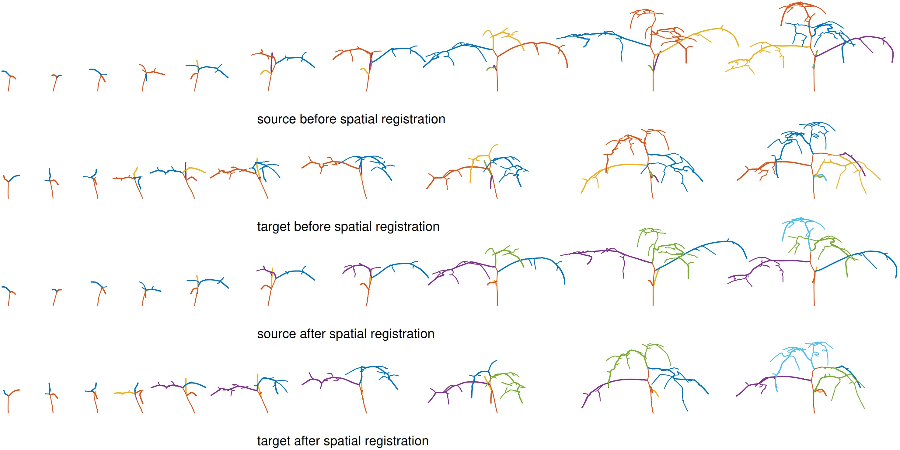

# 4Dtreeshape_project

Step-by-step-guide:

**Step 1:**

We extracted skeletons from the pheno4D dataset using the algorithm of [15] in the main manuscript. Save all of the skeletons as a .swc file in the **utlis_data** folder.

Run **visualize_skeleton_point_cloud.m** to see the point clouds of the extracted skeletons.

**Step 2:**

Then, we added branch layer information in those point cloud data. **utils_data** folder contains those preprocessed data, the filename of which is the date of capturing the sample data. Note: we warp out (removing some intermediate samples) some 4D growing plants for temporal registration purposes

Run **Branching_layers.m** to see the growing pattern of plants with branch layer information (color-coded)

**Step 3: (Spatial registration)**

See the spatial registration result between 3D plants across 4D growing plants. color codes indicate the 1st layer correspondences between branches.

Run **Spatial_registration_maize.m** for maize plants

Run **Spatial_registration_tomato.m** for tomato plants

**Step 4: (Temporal registration)**

We then perform temporal registration to synchronize two 4D growing plants with different growth rates.

Run **Tempral_registration_tomato.m** to see the temporal registration result for tomato plants

!(./temporal_reg_result_1_3_1.jpg)

Run **Tempral_registration_maize.m** to see the temporal registration result for maize plants

**Step 4: (Geodesic)**

Run **Geodesic_computation_before_reg.m** to compute geodesic between two 4D growing tomato plants before spatiotemporal registration

Run **Geodesic_computation_after_reg.m** to compute geodesic between two growing 4D tomato plants after spatiotemporal registration

!(./geod_1_3_after_reg_1.jpg)

Run **Maize_Geodesic_computation.m** to compute geodesic between two growing 4D maize plants after spatiotemporal registration

**Step 5: (Statistics)**

Run **Mean_tomato.m** to compute the mean of the registered shapes in the dataset (for tomato plants)

Run **Mean_maize.m** to compute the mean of the registered shapes in the dataset (for maize plants)

Run **Modes_maize.m** to compute modes of variations of the registered shapes in the dataset (for maize plants)

Run **Modes_tomato.m** to compute modes of variations of the registered shapes in the dataset (for tomato plants)

Run **Synthesize_tomato.m** to synthesize some random patterns (for tomato plants)

Run **Synthesize_mazie.m** to synthesize some random patterns (for maize plants)

(**Note:** Mathematical implementation for both maize and tomato plants are the same. We provide results in two different files for good visualization as their shapes are different.)

Please compile DynamicProgramming.c in Matlab before using programs.

